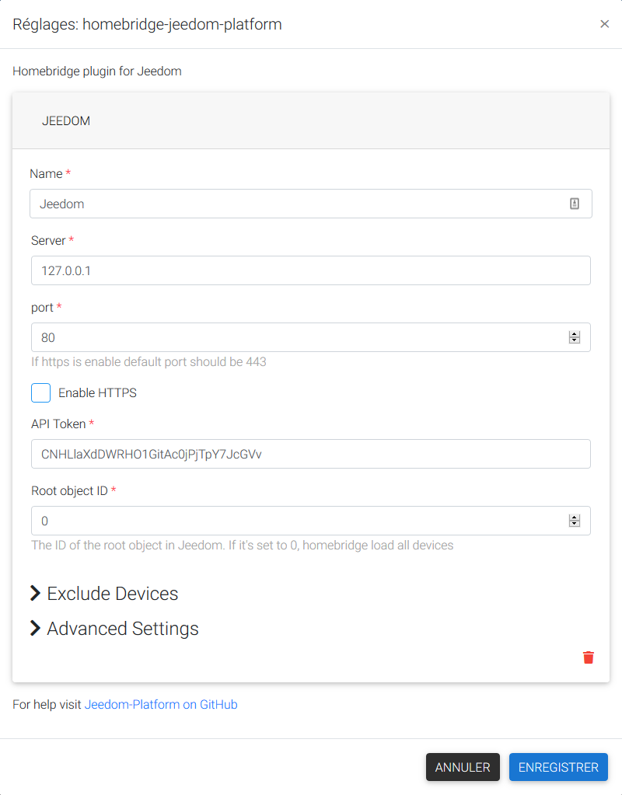

# Homebridge-Jeedom-Platform
This is a plugin for [Homebridge](https://github.com/nfarina/homebridge) and [Homebridge Config UI X Support](https://github.com/oznu/homebridge-config-ui-x) and [Jeedom](https://www.jeedom.com/).

## Supports:
<details>
<summary><b>Standard HomeKit Types (supported by Home.app):</b></summary>
    
- Lamps (on/off)
- Lamps (dimmer)
- Lamps (color)
</details>

## Installation

**Option 1: Install via Homebridge Config UI X:**

 1. Navigate to the Plugins page in in [homebridge-config-ui-x](https://github.com/oznu/homebridge-config-ui-x).
 2. Search for "jeedom" and install homebridge-jeedom-platform.

**Option 2: Manually Install:**
```
sudo npm install -g homebridge-jeedom-platform
```

## Update

**Option 1: Update via Homebridge Config UI X:**

 1. Navigate to the Plugins page in [homebridge-config-ui-x](https://github.com/oznu/homebridge-config-ui-x).
 2. Click the Update button for the Jeedom platform plugin.

**Option 2: Manually Update:**
```
sudo npm update -g homebridge-jeedom-platform
```

## Configuration

To configure homebridge-jeedom-platform you must also be running [homebridge-config-ui-x](https://github.com/oznu/homebridge-config-ui-x).

 1. Navigate to the Plugins page in homebridge-config-ui-x.
 2. Click the Settings button for the Jeedom Platform plugin.
 
 
 
### Manual Settings

<details><summary><b>Manual Configuration</b></summary>

~/.homebridge/config.json example:
```js
{
    "bridge": {
        "name": "Homebridge",
        "username": "CC:21:3E:E4:DE:33",
        "port": 51826,
        "pin": "031-45-154"
    },
    "platforms": [
        {
	    "platform": "HomebridgeJeedomPlatform",
	    "name": "Jeedom",
	    "server": "127.0.0.1",
	    "port": 80,
	    "https": 0,
	    "token": "CNHLlaXdDWRHO1GitAc0jPjTpY7JcGVv",
	    "rootObjectId": 0,
	    "devicesSyncInterval": 10,
	    "deviceStateSyncInterval": 10,
	    "excludedDevices": []
        }
    ],
    "accessories": []
}
```
To prevent certain Jeedom devices from showing up in HomeBridge it is possible to exclude them by setting the "excludedDevices" parameter.
Provide an array of Jeedom Device ID's, which can be found in the Jeedom dashboard on the "Analysis > Home Automation summary" page and look for the "id" at the start of each line of device.

```js
"excludedDevices": ["12","30","129"]
```
</details>

<details><summary><b>Advanced Configuration</b></summary>

### Devices synchonization interval
By default, the plugin synchronize the hardware informations every 10 minutes. You can increase or decrease this intervale or cancel the synchonization by setting at 0.

### Device state synchonization interval
By default, the plugin synchronize the device staye every 10 seconde. You can increase or decrease this intervale. You cant't cancel the synchonization by setting at 0.
</details>

## Tips

### Issues pairing to Homebridge when you have a lot of Jeedom devices...
If you have more than 99 devices in Jeedom, you need to limit the number of devices exposed to HomeKit (Homebridge only supports 99 Accessories on a single bridge - whilst we could combine multiple sensors into a single homekit accessory within the plugin, the possible combinations out there are endless, so we won't).

Therefore, to reduce the number of devices exposed from Jeedom, create a object within Jeedom via Tools > Objects. Add only the devices you wish to be exposed to HomeKit to this new object within Jeedom, and then get it's ID number. Set "rootObjectId" in your config.json file to this object number.

### Is my device supported??
To get your device work with domoticz, check the "Type generic" of each command of the device in advanced parameters of command. A lightbulb must have a Light button on, a Light button off ans a Light state for example.

### Logging
Complies with Homebridge's native logging & debugging methodology - see https://github.com/nfarina/homebridge/wiki/Basic-Troubleshooting
